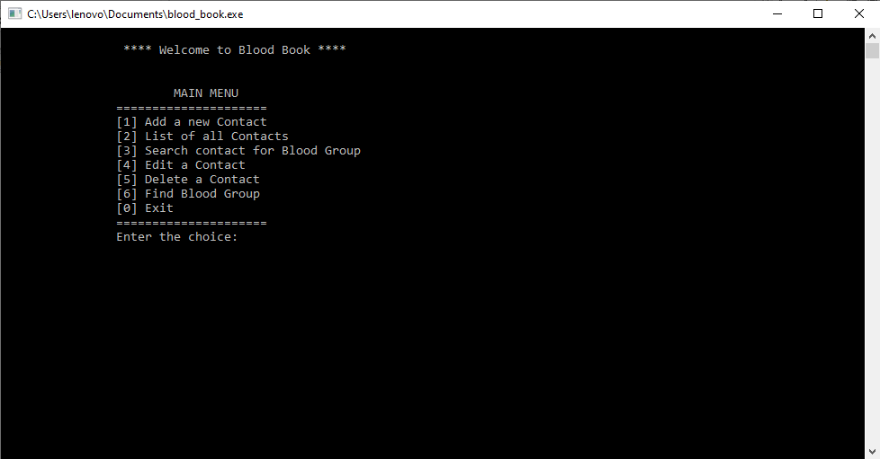

# Blood Group Management System 

## Abstract
>*A blood book management system which allows the user to store someone's Name, Phone number, Blood Group, Email and Address. The operations on the management system include the ability to append new entries, modify them as well as delete unwanted ones and list the entries in a sort order. A structured file system was implemented to store the data. This tiny whole project was tested and it's performance evaluated.*


## Installation
Use GNU gcc complier to compile.
```bash
gcc blood_book.c -o blood_book 
```

run.
```bash 
./blood_book
```


## Usage
>


## Conculasion
```
Author          :   Samiur Rahman Prapon, Jibon Krisna Saha
Submitted to    :   Dr. Hasan U Zaman
                    Profesor,
                    Department of Electrical & Computer Engineering
                    North South University, Bangladesh.
Submission Date :   17/04/2017
```
